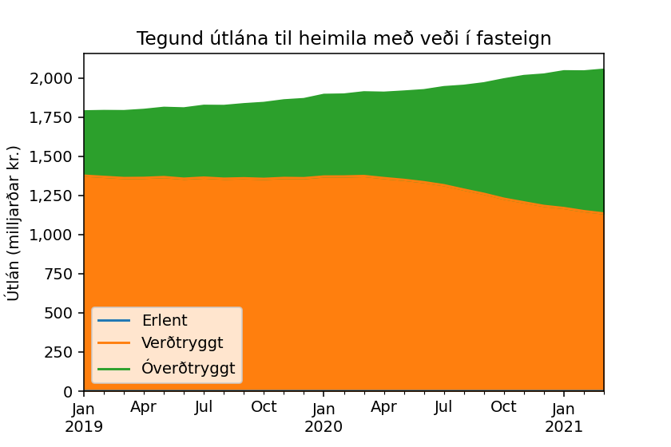
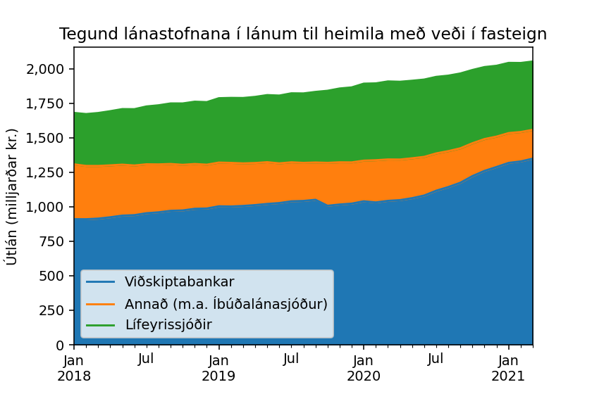

# Seðlabanki Húsnæðisgögn

Seðlabankinn miðlar gögnum um útlán með veði í heimilum í Excel skjölum.

Þetta er kóði til að sækja sjálfvirkt nýjustu skjölin, pilla út réttar tímaraðir
og setja í SQLite grunn.

Til að smíða grunninn frá … grunni …

```bash
poetry install
rm housing.db
poetry run python main.py
# hér er hægt að gera git diff til að sjá hvort að housing.db sé breytt eða ekki
poetry run datasette publish cloudrun housing.db --service=sedlabanki-housing
# hér er hægt að keyra Notebook.ipynb til að uppfæra grafið
```





Gögn um [þróun verðlags](https://px.hagstofa.is/pxis/pxweb/is/Efnahagur/Efnahagur__visitolur__1_vnv__1_vnv/VIS01000.px)

TODO:

- Sækja verðlagsgögn sjálfvirkt
